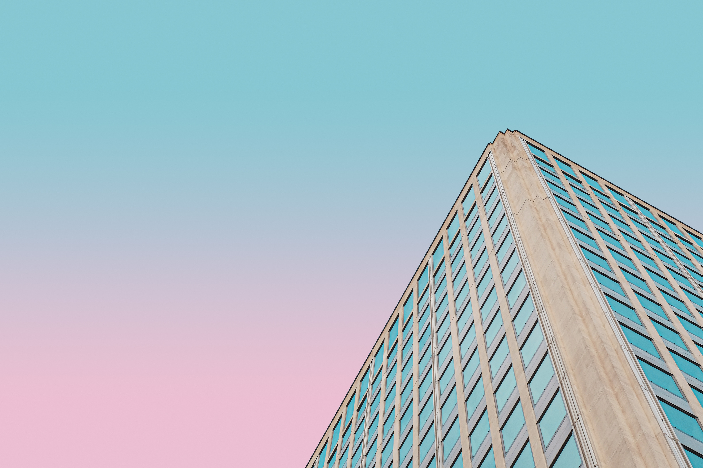
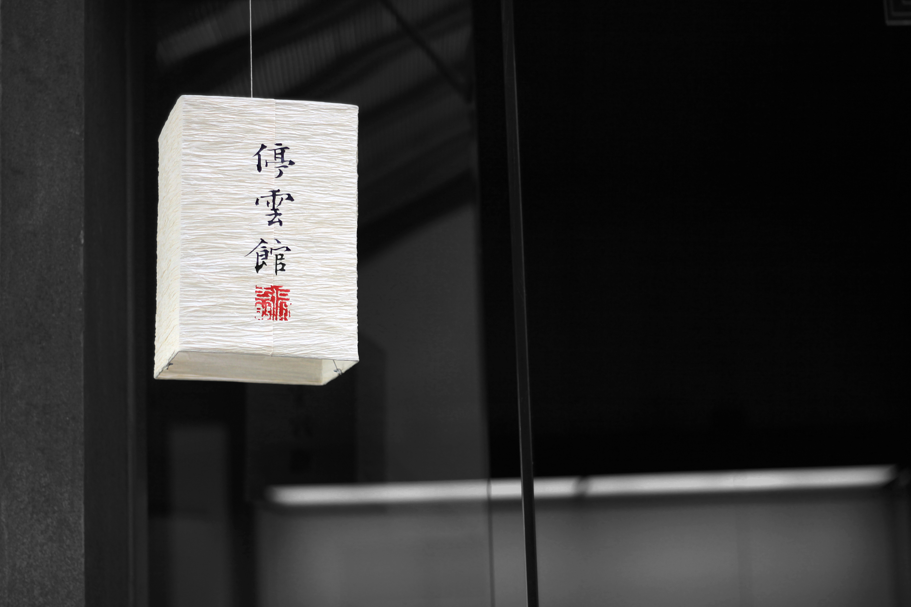
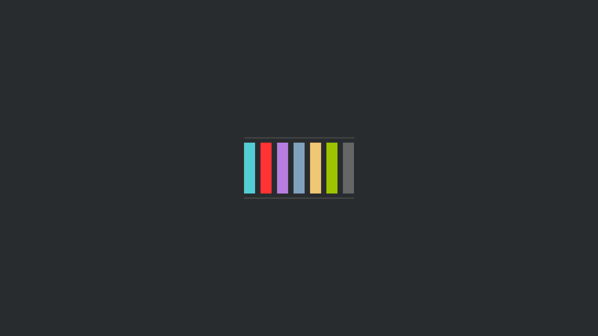
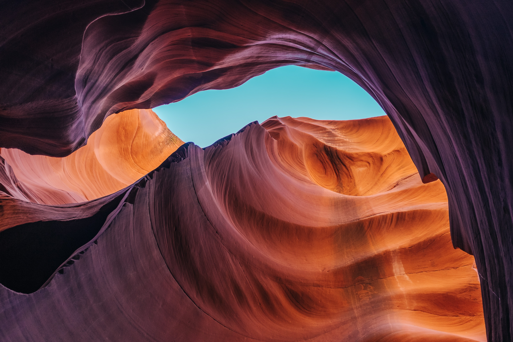
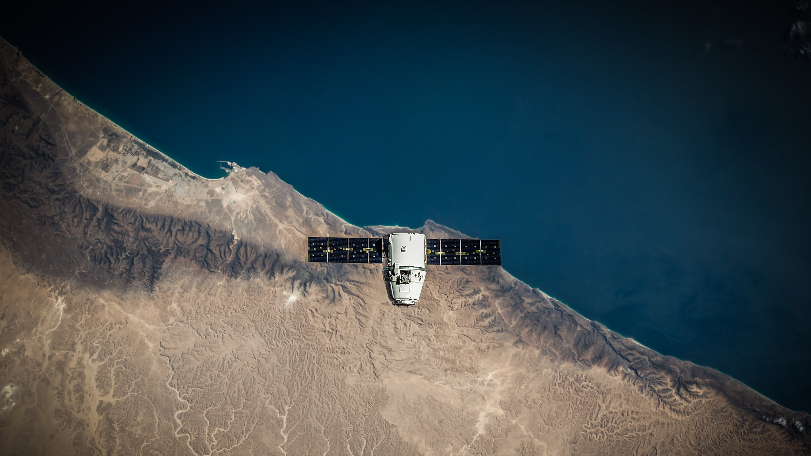
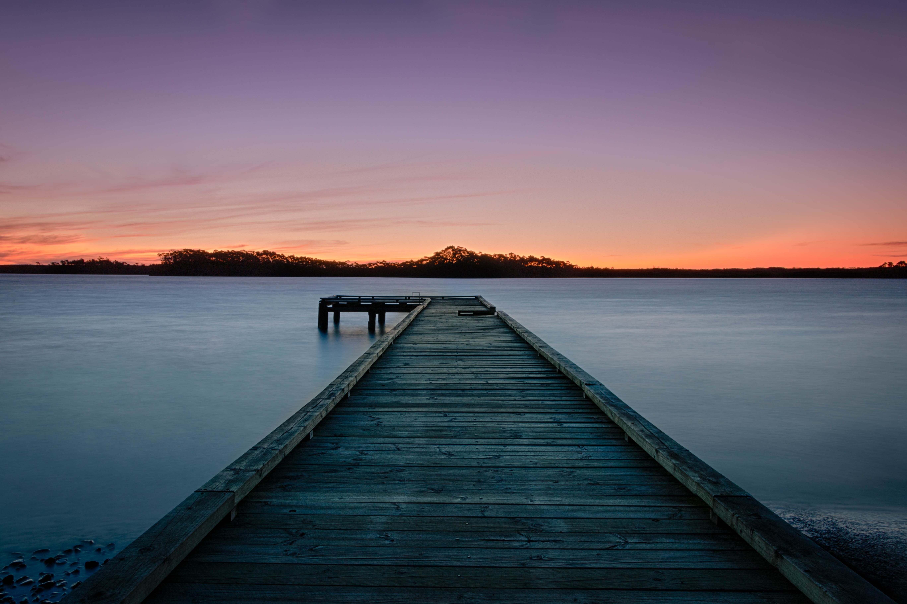

# Dotfiles

These Dotfiles include dynamic wallpaper depended colorschemes for i3, i3bar,
rofi, dunst and the terminal.

Each i3 reload applies a different wallpaper + a colorscheme based on it using
[pywal](https://github.com/dylanaraps/pywal) to create and set wallpapers. This
script includes a wallpaper selector made with dmenu.

## Screenshots:

### Rofi:


### Floating Terminal:


### Tiling:


### Notification


### Dmenu selection:


### Nvim


## Includes:

-   [nvim](/nvim)
-   [i3](/i3)
-   [i3status](/i3status)
-   [fish](/fish)
-   [alacritty](/alacritty)
-   [dunst](/dunst)

## Deps:

-   i3-gaps
-   python
-   pywal
-   dunst
-   dmenu
-   rofi

```
sudo pacman -S i3 python dunst alacritty ranger w3m dmenu rofi; sudo python3 -m pip install pywal || sudo pip install pywal;
```

## Wallpapers:

> taken from `r/wallpapers`, `r/unixporn` and several google searches




















